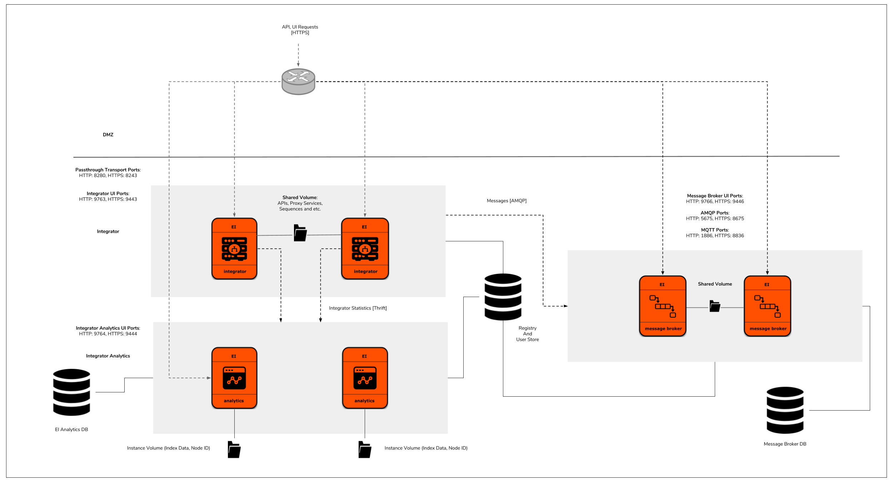

# Kubernetes Resources for a deployment of Integrator and Broker profiles of WSO2 Enterprise Integrator with Analytics

Core Kubernetes resources for a clustered deployment of Integrator and Broker profiles of WSO2 Enterprise Integrator with Integrator Analytics support.



## Contents

* [Prerequisites](#prerequisites)
* [Quick Start Guide](#quick-start-guide)

## Prerequisites

* In order to use WSO2 Kubernetes resources, you need an active WSO2 subscription. If you do not possess an active
WSO2 subscription already, you can sign up for a WSO2 Free Trial Subscription from [here](https://wso2.com/free-trial-subscription).<br><br>

* Install [Git](https://git-scm.com/book/en/v2/Getting-Started-Installing-Git) and [Kubernetes client](https://kubernetes.io/docs/tasks/tools/install-kubectl/) (compatible with v1.10)
in order to run the steps provided in the following quick start guide.<br><br>

* An already setup [Kubernetes cluster](https://kubernetes.io/docs/setup/pick-right-solution/).<br><br>

* A pre-configured Network File System (NFS) to be used as the persistent volume for artifact sharing and persistence.
In the NFS server instance, create a Linux system user account named `wso2carbon` with user id `802` and a system group named `wso2` with group id `802`.
Add the `wso2carbon` user to the group `wso2`.

```
groupadd --system -g 802 wso2
useradd --system -g 802 -u 802 wso2carbon
```

## Quick Start Guide

>In the context of this document, `KUBERNETES_HOME` will refer to a local copy of the [`wso2/kubernetes-ei`](https://github.com/wso2/kubernetes-ei/)
Git repository.<br>

##### 1. Clone the Kubernetes Resources for WSO2 Enterprise Integrator Git repository.

```
git clone https://github.com/wso2/kubernetes-ei.git
```

##### 2. Create a namespace named `wso2` and a service account named `wso2svc-account`, within the namespace `wso2`.

```
kubectl create namespace wso2
kubectl create serviceaccount wso2svc-account -n wso2
```

Then, switch the context to new `wso2` namespace.

```
kubectl config set-context $(kubectl config current-context) --namespace=wso2
```

##### 3. Create a Kubernetes Secret for pulling the required Docker images from [`WSO2 Docker Registry`](https://docker.wso2.com).

Create a Kubernetes Secret named `wso2creds` in the cluster to authenticate with the WSO2 Docker Registry, to pull the required images.

```
kubectl create secret docker-registry wso2creds --docker-server=docker.wso2.com --docker-username=<WSO2_USERNAME> --docker-password=<WSO2_PASSWORD> --docker-email=<WSO2_USERNAME>
```

`WSO2_USERNAME`: Your WSO2 username<br>
`WSO2_PASSWORD`: Your WSO2 password

Please see [Kubernetes official documentation](https://kubernetes.io/docs/tasks/configure-pod-container/pull-image-private-registry/#create-a-secret-in-the-cluster-that-holds-your-authorization-token)
for further details.

##### 4. Setup product database(s).

Setup the external product databases. Please refer to WSO2's official documentation [1](https://docs.wso2.com/display/EI620/Clustering+the+ESB+Profile#ClusteringtheESBProfile-Creatingthedatabases),
[2](https://docs.wso2.com/display/EI620/Clustering+the+Message+Broker+Profile#ClusteringtheMessageBrokerProfile-Creatingthedatabases) and
[3](https://docs.wso2.com/display/EI620/Minimum+High+Availability+Deployment) on creating the required databases for the deployment.

Provide appropriate connection URLs, corresponding to the created external databases and the relevant driver class names for the data sources defined in
the following files:

* `<KUBERNETES_HOME>/integrator-broker-analytics/confs/broker/datasources/master-datasources.xml`
* `<KUBERNETES_HOME>/integrator-broker-analytics/confs/ei-analytics-1/conf/worker/deployment.yaml`
* `<KUBERNETES_HOME>/integrator-broker-analytics/confs/dashboard/conf/dashboard/deployment.yaml`
* `<KUBERNETES_HOME>/integrator-broker-analytics/confs/integrator/datasources/master-datasources.xml`

Please refer WSO2's [official documentation](https://docs.wso2.com/display/ADMIN44x/Configuring+master-datasources.xml) on configuring data sources.

**Note**:

* For **evaluation purposes**, you can use Kubernetes resources provided in the directory<br>
`<KUBERNETES_HOME>/integrator-broker-analytics/extras/rdbms/mysql` for deploying the product databases, using MySQL in Kubernetes. However, this approach of product database deployment is
**not recommended** for a production setup.

* For using these Kubernetes resources,

    first create a Kubernetes ConfigMap for passing database script(s) to the deployment.
    
    ```
    kubectl create configmap mysql-dbscripts --from-file=<KUBERNETES_HOME>/integrator-broker-analytics/extras/confs/mysql/dbscripts/
    ```
    
    Here, a Network File System (NFS) is needed to be used for persisting MySQL DB data.
    
    Create and export a directory within the NFS server instance.
    
    Provide read-write-execute permissions to other users for the created folder.
    
    Update the Kubernetes Persistent Volume resource with the corresponding NFS server IP (`NFS_SERVER_IP`) and exported,
    NFS server directory path (`NFS_LOCATION_PATH`) in `<KUBERNETES_HOME>/integrator-broker-analytics/extras/rdbms/volumes/persistent-volumes.yaml`.
    
    Deploy the persistent volume resource and volume claim as follows:
    
    ```
    kubectl create -f <KUBERNETES_HOME>/integrator-broker-analytics/extras/rdbms/mysql/mysql-persistent-volume-claim.yaml
    kubectl create -f <KUBERNETES_HOME>/integrator-broker-analytics/extras/rdbms/volumes/persistent-volumes.yaml
    ```

    Then, create a Kubernetes service (accessible only within the Kubernetes cluster) and followed by the MySQL Kubernetes deployment, as follows:
    
    ```
    kubectl create -f <KUBERNETES_HOME>/integrator-broker-analytics/extras/rdbms/mysql/mysql-service.yaml
    kubectl create -f <KUBERNETES_HOME>/integrator-broker-analytics/extras/rdbms/mysql/mysql-deployment.yaml
    ```
     
##### 5. Create a Kubernetes role and a role binding necessary for the Kubernetes API requests made from Kubernetes membership scheme.

```
kubectl create --username=admin --password=<K8S_CLUSTER_ADMIN_PASSWORD> -f <KUBERNETES_HOME>/rbac/rbac.yaml
```

`K8S_CLUSTER_ADMIN_PASSWORD`: Kubernetes cluster admin password

##### 6. Setup a Network File System (NFS) to be used for persistent storage.

Create and export unique directories within the NFS server instance for each Kubernetes Persistent Volume resource defined in the
`<KUBERNETES_HOME>/integrator-analytics/volumes/persistent-volumes.yaml` file.

Grant ownership to `wso2carbon` user and `wso2` group, for each of the previously created directories.

```
sudo chown -R wso2carbon:wso2 <directory_name>
```

Grant read-write-execute permissions to the `wso2carbon` user, for each of the previously created directories.

```
chmod -R 700 <directory_name>
```

Update each Kubernetes Persistent Volume resource with the corresponding NFS server IP (`NFS_SERVER_IP`) and exported, NFS server directory path (`NFS_LOCATION_PATH`).

Then, deploy the persistent volume resources and volume claims as follows:

```
kubectl create -f <KUBERNETES_HOME>/integrator-broker-analytics/broker/message-broker-volume-claim.yaml
kubectl create -f <KUBERNETES_HOME>/integrator-broker-analytics/integrator/integrator-volume-claims.yaml
kubectl create -f <KUBERNETES_HOME>/integrator-broker-analytics/volumes/persistent-volumes.yaml
```
    
##### 7. Create Kubernetes ConfigMaps for passing WSO2 product configurations into the Kubernetes cluster.

```
kubectl create configmap mb-conf --from-file=<KUBERNETES_HOME>/integrator-broker-analytics/confs/broker
kubectl create configmap mb-conf-axis2 --from-file=<KUBERNETES_HOME>/integrator-broker-analytics/confs/broker/axis2/
kubectl create configmap mb-conf-datasources --from-file=<KUBERNETES_HOME>/integrator-broker-analytics/confs/broker/datasources/

kubectl create configmap integrator-conf --from-file=<KUBERNETES_HOME>/integrator-broker-analytics/confs/integrator/conf
kubectl create configmap integrator-conf-axis2 --from-file=<KUBERNETES_HOME>/integrator-broker-analytics/confs/integrator/conf/axis2/
kubectl create configmap integrator-conf-datasources --from-file=<KUBERNETES_HOME>/integrator-broker-analytics/confs/integrator/conf/datasources/
kubectl create configmap integrator-conf-event-publishers --from-file=<KUBERNETES_HOME>/integrator-broker-analytics/confs/integrator/repository/deployment/server/eventpublishers/

kubectl create configmap ei-analytics-1-conf-worker --from-file=<KUBERNETES_HOME>/integrator-broker-analytics/confs/ei-analytics-1/conf/worker

kubectl create configmap ei-analytics-2-conf-worker --from-file=<KUBERNETES_HOME>/integrator-broker-analytics/confs/ei-analytics-2/conf/worker

kubectl create configmap sp-dashboard-conf-dashboard --from-file=<KUBERNETES_HOME>/integrator-broker-analytics/confs/dashboard/conf/dashboard
```

##### 8. Create Kubernetes Services and Deployments for WSO2 Enterprise Integrator, Broker and Analytics.

```
kubectl create -f <KUBERNETES_HOME>/integrator-broker-analytics/analytics/integrator-analytics-1-deployment.yaml
kubectl create -f <KUBERNETES_HOME>/integrator-broker-analytics/analytics/integrator-analytics-1-service.yaml
kubectl create -f <KUBERNETES_HOME>/integrator-broker-analytics/analytics/integrator-analytics-2-deployment.yaml
kubectl create -f <KUBERNETES_HOME>/integrator-broker-analytics/analytics/integrator-analytics-2-service.yaml
kubectl create -f <KUBERNETES_HOME>/integrator-broker-analytics/analytics/integrator-analytics-service.yaml

kubectl create -f <KUBERNETES_HOME>/integrator-broker-analytics/integrator/integrator-service.yaml
kubectl create -f <KUBERNETES_HOME>/integrator-broker-analytics/integrator/integrator-gateway-service.yaml
kubectl create -f <KUBERNETES_HOME>/integrator-broker-analytics/integrator/integrator-deployment.yaml

kubectl create -f <KUBERNETES_HOME>/integrator-broker-analytics/broker/message-broker-service.yaml
kubectl create -f <KUBERNETES_HOME>/integrator-broker-analytics/broker/message-broker-deployment.yaml

kubectl create -f <KUBERNETES_HOME>/integrator-broker-analytics/dashboard/integrator-server-dashboard-service.yaml
kubectl create -f <KUBERNETES_HOME>/integrator-broker-analytics/dashboard/integrator-server-dashboard-deployment.yaml


```

##### 9. Deploy Kubernetes Ingress resource.

The WSO2 Enterprise Integrator Kubernetes Ingress resource uses the NGINX Ingress Controller.

In order to enable the NGINX Ingress controller in the desired cloud or on-premise environment,
please refer the official documentation, [NGINX Ingress Controller Installation Guide](https://kubernetes.github.io/ingress-nginx/deploy/).

Finally, deploy the WSO2 Enterprise Integrator Kubernetes Ingress resources as follows:

```
kubectl create -f <KUBERNETES_HOME>/integrator-broker-analytics/ingresses/message-broker-ingress.yaml
kubectl create -f <KUBERNETES_HOME>/integrator-broker-analytics/ingresses/integrator-ingress.yaml
kubectl create -f <KUBERNETES_HOME>/integrator-broker-analytics/ingresses/integrator-gateway-ingress.yaml
kubectl create -f <KUBERNETES_HOME>/integrator-broker-analytics/ingresses/integrator-server-dashboard-ingress.yaml
```

##### 10. Access Management Consoles.

Default deployment will expose `wso2ei-integrator`, `wso2ei-broker`, `wso2ei-integrator-gateway` and `wso2ei-analytics` hosts.

To access the console in the environment,

a. Obtain the external IP (`EXTERNAL-IP`) of the Ingress resources by listing down the Kubernetes Ingresses.

```
kubectl get ing
```
e.g.

```
NAME                                        HOSTS                       ADDRESS        PORTS     AGE
wso2ei-analytics-ingress                    wso2ei-dashboard            <EXTERNAL-IP>  80, 443   2m
wso2ei-integrator-gateway-tls-ingress       wso2ei-integrator-gateway   <EXTERNAL-IP>  80, 443   2m
wso2ei-integrator-ingress                   wso2ei-integrator           <EXTERNAL-IP>  80, 443   2m
wso2ei-mb-ingress                           wso2ei-broker               <EXTERNAL-IP>  80, 443   2m
```

b. Add the above host as an entry in /etc/hosts file as follows:

```
<EXTERNAL-IP>	wso2ei-dashboard
<EXTERNAL-IP>	wso2ei-integrator-gateway
<EXTERNAL-IP>	wso2ei-integrator
<EXTERNAL-IP>	wso2ei-broker
```

c. Try navigating to `https://wso2ei-integrator/carbon`, `https://wso2ei-broker/carbon` and `https://wso2ei-dashboard/portal` from your favorite browser.

##### 11. Scale up using `kubectl scale`.

Default deployment runs a single replica (or pod) of WSO2 Enterprise Integrator's Integrator profile. To scale this deployment into any `<n>` number of
container replicas, upon your requirement, simply run following Kubernetes client command on the terminal.

```
kubectl scale --replicas=<n> -f <KUBERNETES_HOME>/integrator-broker-analytics/integrator/integrator-deployment.yaml
```

For example, If `<n>` is 2, you are here scaling up this deployment from 1 to 2 container replicas.
