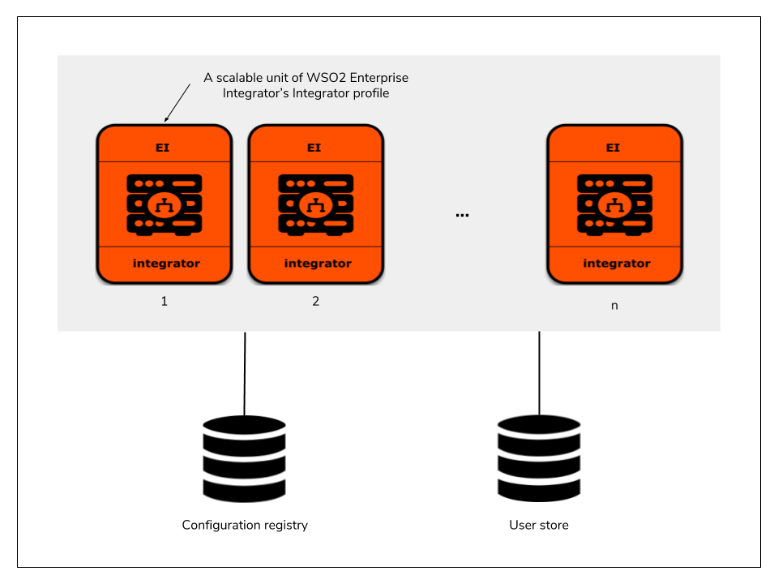

# Kubernetes Resources for deployment of Integrator profile of WSO2 Enterprise Integrator

Core Kubernetes resources for deployment of a "scalable" unit of WSO2 Enterprise Integrator's Integrator profile.



## Prerequisites

* Install [Git](https://git-scm.com/book/en/v2/Getting-Started-Installing-Git), [Docker](https://www.docker.com/get-docker)
(version 17.09.0 or above) and [Kubernetes client](https://kubernetes.io/docs/tasks/tools/install-kubectl/)
in order to run the steps provided<br>in the following quick start guide.<br><br>

* An already setup [Kubernetes cluster](https://kubernetes.io/docs/setup/pick-right-solution/)<br><br>
 
## Quick Start Guide

>In the context of this document, `KUBERNETES_HOME` will refer to a local copy of the [`wso2/kubernetes-ei`](https://github.com/wso2/kubernetes-ei/)
Git repository.<br>

##### 1. Checkout Kubernetes Resources for WSO2 Enterprise Integrator Git repository:

```
git clone https://github.com/wso2/kubernetes-ei.git
```

##### 2. Build the Docker images using the [`Docker resources`](../dockerfiles) provided in this repository.

##### 3. Copy the Docker images into the Kubernetes Nodes or Registry:

Copy the required Docker images over to the Kubernetes Nodes (e.g. use `docker save` to create a tarfile of the 
required image, `scp` the tarfile to each node and use `docker load` to load the image from the copied tarfile 
within the nodes).

Alternatively, if a private Docker registry is used, transfer the images there.

##### 4. Setup and configure external product database(s):

Setup the external product databases. Please refer to WSO2 Enterprise Integrator's [official documentation](https://docs.wso2.com/display/EI620/Clustering+the+ESB+Profile#ClusteringtheESBProfile-Creatingthedatabases)
on creating the required databases for the deployment.

Provide appropriate connection URLs, corresponding to the created external databases and the relevant driver class names for the data sources defined in
`KUBERNETES_HOME/pattern-1/conf/integrator/conf/datasources/master-datasources.xml` file. Please refer WSO2 Enterprise Integrator's
[official documentation](https://docs.wso2.com/display/EI620/Configuring+master-datasources.xml) on configuring data sources.

**Note**:

* For **evaluation purposes**, you can use Kubernetes resources provided in the directory<br>
`KUBERNETES_HOME/pattern-1/test/rdbms/mysql` for deploying the product databases, using MySQL in Kubernetes. However, this approach of product database deployment is
**not recommended** for a production setup.

* For using these Kubernetes resources,

    first create the Kubernetes ConfigMaps for passing MySQL configurations and database scripts to the deployment.
    
    ```
    kubectl create configmap mysql-conf --from-file=<KUBERNETES_HOME>/pattern-1/conf/mysql/conf/
    kubectl create configmap mysql-dbscripts --from-file=<KUBERNETES_HOME>/pattern-1/conf/mysql/dbscripts/
    ```

    Then, create a Kubernetes service (accessible only within the Kubernetes cluster) and followed by the MySQL Kubernetes deployment, as follows:
    
    ```
    kubectl create -f <KUBERNETES_HOME>/pattern-1/test/rdbms/mysql/mysql-service.yaml
    kubectl create -f <KUBERNETES_HOME>/pattern-1/test/rdbms/mysql/mysql-deployment.yaml
    ```
    
##### 5. Create Kubernetes ConfigMaps for passing WSO2 product configurations into the Kubernetes cluster:

```
kubectl create configmap integrator-conf --from-file=<KUBERNETES_HOME>/pattern-1/conf/integrator/conf/
kubectl create configmap integrator-conf-axis2 --from-file=<KUBERNETES_HOME>/pattern-1/conf/integrator/conf/axis2/
kubectl create configmap integrator-conf-datasources --from-file=<KUBERNETES_HOME>/pattern-1/conf/integrator/conf/datasources/
```

##### 6. Create Kubernetes Services and Deployments for WSO2 Enterprise Integrator:

```
kubectl create -f <KUBERNETES_HOME>/pattern-1/integrator/integrator-service.yaml
kubectl create -f <KUBERNETES_HOME>/pattern-1/integrator/integrator-gateway-service.yaml
kubectl create -f <KUBERNETES_HOME>/pattern-1/integrator/integrator-deployment.yaml
```

##### 7. Deploy NGNIX Ingress Controller:

```
kubectl create -f <KUBERNETES_HOME>/pattern-1/ingresses/nginx-default-backend.yaml
kubectl create -f <KUBERNETES_HOME>/pattern-1/ingresses/nginx-ingress-controller.yaml
kubectl create -f <KUBERNETES_HOME>/pattern-1/ingresses/integrator-ingress.yaml
```

##### 8. Access Management Console:

Default deployment will expose two publicly accessible hosts, namely: <br>
1. `wso2ei-pattern1-integrator` - To expose Administrative services and Management Console <br>
2. `wso2ei-pattern1-integrator-gateway` - To expose Mediation Gateway <br>

To access the console in a test environment, add the above two hosts as entries in /etc/hosts file, pointing to one of<br>
your Kubernetes cluster node IPs and try navigating to `https://wso2ei-pattern1-integrator/carbon` from your favorite browser.

##### 9. How to scale using `kubectl scale`:

Default deployment runs only one replica (or pod) of Integrator profile. To scale this deployment into <br>
any `<n>` number of container replicas, necessary to suite your requirement, simply run following kubectl 
command on the terminal. 
```
kubectl scale --replicas=<n> -f <KUBERNETES_HOME>/pattern-1/integrator/integrator-deployment.yaml
```
For example, If `<n>` is 3, you are here scaling up this deployment from 1 to 3 container replicas.
