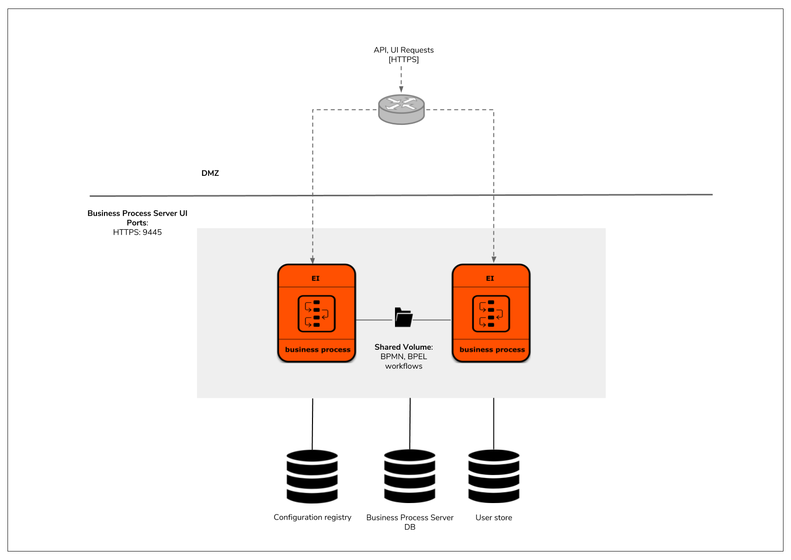

# Kubernetes Resources for deployment of Business Process Server (BPS) profile of WSO2 Enterprise Integrator

Core Kubernetes resources for a clustered deployment of WSO2 Enterprise Integrator's BPS profile.



## Prerequisites

* In order to use these Kubernetes resources, you will need an active [Free Trial Subscription](https://wso2.com/free-trial-subscription)
from WSO2 since the referring Docker images hosted at docker.wso2.com contains the latest updates and fixes for WSO2 Enterprise Integrator.
You can sign up for a Free Trial Subscription [here](https://wso2.com/free-trial-subscription).<br><br>

* Install [Git](https://git-scm.com/book/en/v2/Getting-Started-Installing-Git), [Docker](https://www.docker.com/get-docker)
(version 17.09.0 or above) and [Kubernetes client](https://kubernetes.io/docs/tasks/tools/install-kubectl/)
in order to run the steps provided<br>in the following quick start guide.<br><br>

* An already setup [Kubernetes cluster](https://kubernetes.io/docs/setup/pick-right-solution/)<br><br>
 
## Quick Start Guide

>In the context of this document, `KUBERNETES_HOME` will refer to a local copy of the [`wso2/kubernetes-ei`](https://github.com/wso2/kubernetes-ei/)
Git repository.<br>

##### 1. Checkout Kubernetes Resources for WSO2 Enterprise Integrator Git repository:

```
git clone https://github.com/wso2/kubernetes-ei.git
```

##### 2. Create a namespace named `wso2` and a service account named `wso2svc-account`, within the namespace `wso2`.

```
kubectl create namespace wso2
kubectl create serviceaccount wso2svc-account -n wso2
```

Then, switch the context to new `wso2` namespace from `default` namespace.

```
kubectl config set-context $(kubectl config current-context) --namespace=wso2
```

##### 3. Create a Kubernetes Secret for pulling the required Docker images from [`WSO2 Docker Registry`](https://docker.wso2.com):

Create a Kubernetes Secret named `wso2creds` in the cluster to authenticate with the WSO2 Docker Registry, to pull the required images.

```
kubectl create secret docker-registry wso2creds --docker-server=docker.wso2.com --docker-username=<username> --docker-password=<password> --docker-email=<email>
```

`username`: Username of your Free Trial Subscription<br>
`password`: Password of your Free Trial Subscription<br>
`email`: Docker email

Please see [Kubernetes official documentation](https://kubernetes.io/docs/tasks/configure-pod-container/pull-image-private-registry/#create-a-secret-in-the-cluster-that-holds-your-authorization-token)
for further details.

##### 4. Setup and configure external product database(s):

Setup the external product databases. Please refer to WSO2 Enterprise Integrator's [official documentation](https://docs.wso2.com/display/EI620/Clustering+the+Business+Process+Profile#ClusteringtheBusinessProcessProfile-Creatingthedatabases)
on creating the required databases for the deployment.

Provide appropriate connection URLs, corresponding to the created external databases and the relevant driver class names for the data sources defined in
the following files:

* `KUBERNETES_HOME/scalable-bps/confs/datasources/master-datasources.xml`
* `KUBERNETES_HOME/scalable-bps/confs/datasources/bps-datasources.xml`
* `KUBERNETES_HOME/scalable-bps/confs/datasources/activiti-datasources.xml`

Please refer WSO2 Enterprise Integrator's [official documentation](https://docs.wso2.com/display/EI620/Configuring+master-datasources.xml) on configuring data sources.

**Note**:

* For **evaluation purposes**, you can use Kubernetes resources provided in the directory<br>
`KUBERNETES_HOME/scalable-bps/test/rdbms/mysql` for deploying the product databases, using MySQL in Kubernetes. However, this approach of product database deployment is
**not recommended** for a production setup.

* For using these Kubernetes resources,

    first create a Kubernetes ConfigMap for passing database script(s) to the deployment.
    
    ```
    kubectl create configmap mysql-dbscripts --from-file=<KUBERNETES_HOME>/scalable-bps/test/confs/mysql/dbscripts/
    ```

    Then, create a Kubernetes service (accessible only within the Kubernetes cluster) and followed by the MySQL Kubernetes deployment, as follows:
    
    ```
    kubectl create -f <KUBERNETES_HOME>/scalable-bps/test/rdbms/mysql/mysql-service.yaml
    kubectl create -f <KUBERNETES_HOME>/scalable-bps/test/rdbms/mysql/mysql-deployment.yaml
    ```
    
##### 5. Create a Kubernetes role and a role binding necessary for the Kubernetes API requests made from Kubernetes membership scheme.

```
kubectl create --username=admin --password=<cluster-admin-password> -f <KUBERNETES_HOME>/rbac/rbac.yaml
```

##### 6. Setup a Network File System (NFS) to be used as the persistent volume for artifact sharing across BPS instances.

Update the NFS server IP (`NFS_SERVER_IP`) and export path (`NFS_LOCATION_APTH`) of persistent volume resource named `bps-server-share-persistent-volume`
in `<KUBERNETES_HOME>/scalable-bps/volumes/persistent-volumes.yaml` file.

Create a user named `wso2carbon` with user id `802` and a group named `wso2` with group id `802` in the NFS node.
Add `wso2carbon` user to the group `wso2`.

Then, provide ownership of the exported folder `NFS_LOCATION_APTH` (used for artifact sharing) to `wso2carbon` user and `wso2` group.
And provide read-write-executable permissions to owning `wso2carbon` user, for the folder `NFS_LOCATION_APTH`.

Then, deploy the persistent volume resource and volume claim as follows:

```
kubectl create -f <KUBERNETES_HOME>/scalable-bps/bps-volume-claim.yaml
kubectl create -f <KUBERNETES_HOME>/scalable-bps/volumes/persistent-volumes.yaml
```
    
##### 7. Create Kubernetes ConfigMaps for passing WSO2 product configurations into the Kubernetes cluster:

```
kubectl create configmap bps-conf --from-file=<KUBERNETES_HOME>/scalable-bps/confs/
kubectl create configmap bps-conf-axis2 --from-file=<KUBERNETES_HOME>/scalable-bps/confs/axis2/
kubectl create configmap bps-conf-datasources --from-file=<KUBERNETES_HOME>/scalable-bps/confs/datasources/
kubectl create configmap bps-conf-etc --from-file=<KUBERNETES_HOME>/scalable-bps/confs/etc/
```

##### 8. Create Kubernetes Services and Deployments for WSO2 Enterprise Integrator BPS:

```
kubectl create -f <KUBERNETES_HOME>/scalable-bps/bps-service.yaml
kubectl create -f <KUBERNETES_HOME>/scalable-bps/bps-deployment.yaml
```

##### 9. Deploy Kubernetes Ingress resource:

The WSO2 Enterprise Integrator Kubernetes Ingress resource uses the NGINX Ingress Controller.

In order to enable the NGINX Ingress controller in the desired cloud or on-premise environment,
please refer the official documentation, [NGINX Ingress Controller Installation Guide](https://kubernetes.github.io/ingress-nginx/deploy/).

Finally, deploy the WSO2 Enterprise Integrator Kubernetes Ingress resources as follows:

```
kubectl create -f <KUBERNETES_HOME>/scalable-bps/ingresses/bps-ingress.yaml
```

##### 10. Access Management Console:

Default deployment will expose the `wso2ei-scalable-bps` host.<br>

To access the console in a test environment,

1. Obtain the external IP (`EXTERNAL-IP`) of the Ingress resources by listing down the Kubernetes Ingresses (using `kubectl get ing`).

e.g.

```
NAME                              HOSTS                         ADDRESS          PORTS     AGE
wso2ei-scalable-bps-ingress       wso2ei-scalable-bps           <EXTERNAL-IP>    80, 443   9m
```

2. Add the above two hosts as entries in /etc/hosts file as follows:

```
<EXTERNAL-IP>	wso2ei-scalable-bps
```

3. Try navigating to the following from your favorite browser:

Management console: `https://wso2ei-scalable-bps/carbon`<br>
BPS HumanTask Explorer: `https://wso2ei-scalable-bps/humantask-explorer`<br>
BPS BPMN Explorer: `https://wso2ei-scalable-bps/bpmn-explorer`
